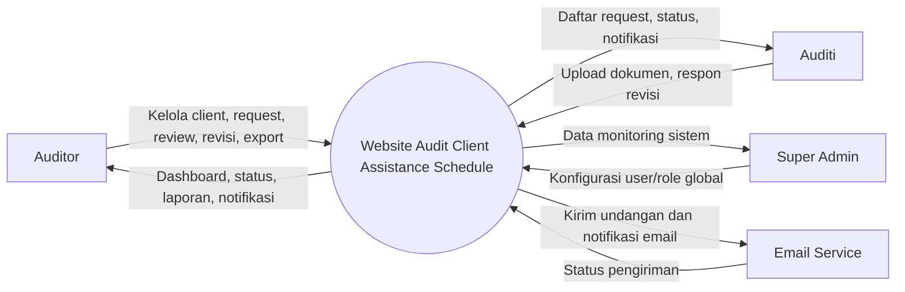
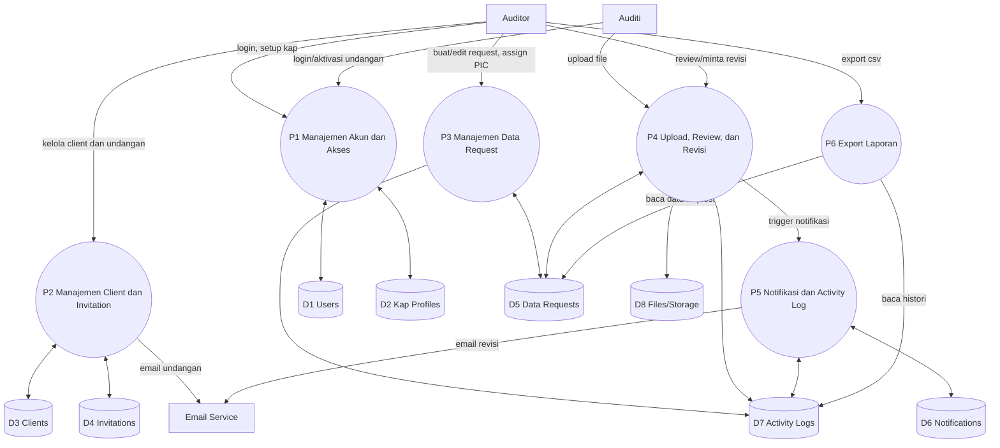

# Dokumentasi Use Case dan DFD

## 1. Ruang Lingkup Sistem
Sistem Website Audit Client Assistance Schedule dipakai untuk kolaborasi Auditor dan Auditi dalam proses permintaan, pengumpulan, review, revisi, serta pelacakan dokumen audit.

## 2. Aktor
- Auditor: membuat data request, mereview file, meminta revisi, ekspor laporan.
- Auditi (Client PIC): menerima tugas data request, unggah file, menindaklanjuti revisi.
- Super Admin: mengelola user/role dan konfigurasi global bila diaktifkan.
- Email Service (eksternal): mengirim email undangan dan notifikasi revisi.

## 3. Use Case Diagram (Naratif)

### 3.1 Daftar Use Case
- UC-01 Login
- UC-02 Kelola Profil KAP
- UC-03 Kelola Client
- UC-04 Kirim Undangan Auditi
- UC-05 Terima Undangan dan Aktivasi Akun
- UC-06 Kelola Data Request
- UC-07 Assign PIC per Data Request
- UC-08 Upload Dokumen
- UC-09 Review Dokumen
- UC-10 Minta Revisi
- UC-11 Lihat Notifikasi
- UC-12 Lihat Activity Log
- UC-13 Export Laporan CSV

### 3.2 Spesifikasi Use Case

#### UC-01 Login
- Aktor: Auditor, Auditi, Super Admin
- Tujuan: masuk ke sistem sesuai role.
- Prasyarat: akun aktif dan kredensial valid.
- Alur utama:
  1. Pengguna membuka halaman login.
  2. Pengguna memasukkan email dan password.
  3. Sistem memvalidasi kredensial.
  4. Sistem mengarahkan ke dashboard sesuai role.
- Alur alternatif:
  1. Kredensial salah.
  2. Sistem menampilkan pesan gagal login.
- Hasil akhir: sesi login aktif.

#### UC-02 Kelola Profil KAP
- Aktor: Auditor
- Tujuan: melengkapi identitas KAP.
- Prasyarat: Auditor sudah login.
- Alur utama:
  1. Auditor membuka halaman profil KAP.
  2. Auditor mengisi data (nama KAP, PIC, alamat, dll).
  3. Sistem menyimpan data profil.
- Hasil akhir: profil KAP tersimpan/terbarui.

#### UC-03 Kelola Client
- Aktor: Auditor
- Tujuan: menambah dan mengelola entitas client audit.
- Prasyarat: profil KAP tersedia.
- Alur utama:
  1. Auditor membuka menu client.
  2. Auditor menambah atau mengubah data client.
  3. Sistem menyimpan perubahan.
- Hasil akhir: data client aktif dan siap digunakan.

#### UC-04 Kirim Undangan Auditi
- Aktor: Auditor
- Tujuan: mengundang PIC client ke sistem.
- Prasyarat: data client tersedia.
- Alur utama:
  1. Auditor membuka Invite Manager.
  2. Auditor memasukkan email auditi.
  3. Sistem membuat token undangan.
  4. Sistem mengirim email undangan.
- Alur alternatif:
  1. Email sudah pernah diundang dan masih aktif.
  2. Sistem menolak duplikasi atau meminta pembaruan undangan.
- Hasil akhir: undangan tercatat dan terkirim.

#### UC-05 Terima Undangan dan Aktivasi Akun
- Aktor: Auditi
- Tujuan: bergabung ke client sesuai undangan.
- Prasyarat: auditi menerima email undangan valid.
- Alur utama:
  1. Auditi membuka tautan undangan.
  2. Auditi melengkapi registrasi/aktivasi.
  3. Sistem menandai undangan accepted.
  4. Sistem menautkan auditi ke client terkait.
- Hasil akhir: akun auditi aktif dan terhubung ke client.

#### UC-06 Kelola Data Request
- Aktor: Auditor
- Tujuan: membuat daftar kebutuhan dokumen audit.
- Prasyarat: client tersedia.
- Alur utama:
  1. Auditor membuka Data Request Table.
  2. Auditor menambah baris request (judul, section, deskripsi, deadline opsional).
  3. Sistem menyimpan request dengan status awal pending.
- Hasil akhir: data request aktif untuk ditindaklanjuti auditi.

#### UC-07 Assign PIC per Data Request
- Aktor: Auditor
- Tujuan: menunjuk auditi spesifik pada tiap request.
- Prasyarat: auditi telah accepted invitation.
- Alur utama:
  1. Auditor memilih baris request.
  2. Auditor memilih PIC (auditi) pada baris tersebut.
  3. Sistem menyimpan pic_id.
- Hasil akhir: request memiliki PIC target.

#### UC-08 Upload Dokumen
- Aktor: Auditi
- Tujuan: mengunggah dokumen pada request.
- Prasyarat: auditi memiliki akses ke client dan request.
- Alur utama:
  1. Auditi membuka request yang ditugaskan.
  2. Auditi memilih file lalu upload.
  3. Sistem menyimpan file ke storage.
  4. Sistem memperbarui status request menjadi on_review.
  5. Sistem mencatat activity log.
- Alur alternatif:
  1. File tidak valid (ukuran/format).
  2. Sistem menolak upload dan menampilkan error validasi.
- Hasil akhir: dokumen tersimpan dan siap direview auditor.

#### UC-09 Review Dokumen
- Aktor: Auditor
- Tujuan: menilai kelengkapan dan kesesuaian dokumen.
- Prasyarat: dokumen sudah diunggah.
- Alur utama:
  1. Auditor membuka detail request.
  2. Auditor membaca dokumen dan komentar.
  3. Auditor memilih keputusan: selesai atau minta revisi.
- Hasil akhir: status request diperbarui sesuai keputusan review.

#### UC-10 Minta Revisi
- Aktor: Auditor
- Tujuan: meminta perbaikan dokumen.
- Prasyarat: ada komentar auditor dan request sedang direview.
- Alur utama:
  1. Auditor mengisi komentar revisi.
  2. Auditor klik aksi minta revisi.
  3. Sistem mengubah status ke partially_received.
  4. Sistem mengirim notifikasi in-app dan email ke auditi terkait (PIC atau semua auditi client jika PIC belum ditetapkan).
  5. Sistem mencatat activity log.
- Hasil akhir: auditi menerima instruksi revisi.

#### UC-11 Lihat Notifikasi
- Aktor: Auditor, Auditi
- Tujuan: mengetahui event terbaru.
- Prasyarat: pengguna login.
- Alur utama:
  1. Pengguna membuka bell notification.
  2. Sistem menampilkan daftar notifikasi terbaru.
  3. Pengguna membuka item notifikasi.
  4. Sistem menandai notifikasi terbaca.
- Hasil akhir: notifikasi terkelola.

#### UC-12 Lihat Activity Log
- Aktor: Auditor
- Tujuan: audit trail perubahan data.
- Prasyarat: aktivitas sudah terjadi pada request.
- Alur utama:
  1. Auditor membuka histori aktivitas.
  2. Sistem menampilkan created/updated/status_changed/deleted beserta pelaku dan waktu.
- Hasil akhir: jejak aktivitas dapat diaudit.

#### UC-13 Export Laporan CSV
- Aktor: Auditor
- Tujuan: mengekspor progres data request.
- Prasyarat: data request tersedia.
- Alur utama:
  1. Auditor klik Export CSV.
  2. Sistem membentuk file CSV dari data tabel.
  3. Sistem mengunduh file ke perangkat auditor.
- Hasil akhir: laporan siap dibagikan.

## 4. Aturan Bisnis Utama
- Status standar request: pending -> on_review -> partially_received -> completed.
- Minta revisi wajib memiliki komentar auditor.
- Jika request memiliki pic_id, notifikasi revisi dikirim hanya ke PIC tersebut.
- Jika request tanpa pic_id, notifikasi revisi dikirim ke seluruh auditi dengan undangan accepted pada client yang sama.
- Upload berulang pada request yang sama tidak menimpa file lama, tetapi menambah versi file baru.

## 5. DFD (Data Flow Diagram)

## 5.1 DFD Level 0 (Context Diagram)

## 5.2 DFD Level 1

## 5.3 Kamus Data Ringkas
- D1 Users: data identitas user, role, kredensial, akun sosial (opsional).
- D2 Kap Profiles: profil KAP milik auditor.
- D3 Clients: data entitas klien audit.
- D4 Invitations: token undangan, email tujuan, status accepted.
- D5 Data Requests: daftar kebutuhan dokumen, status, komentar, pic_id, metadata file.
- D6 Notifications: notifikasi in-app berbasis database.
- D7 Activity Logs: jejak perubahan model dan status.
- D8 Files/Storage: file fisik hasil upload beserta versioning.

## 6. Skenario End-to-End Singkat
1. Auditor login, setup KAP, tambah client.
2. Auditor kirim invitation ke auditi.
3. Auditi aktivasi akun melalui link email.
4. Auditor membuat data request dan assign PIC.
5. Auditi upload dokumen, status menjadi on_review.
6. Auditor review; bila kurang, isi komentar dan minta revisi.
7. Sistem kirim notifikasi in-app + email ke auditi terkait.
8. Auditi upload versi perbaikan.
9. Auditor finalisasi status completed.
10. Auditor ekspor CSV dan cek activity log sebagai bukti audit trail.

## 7. Batasan dan Asumsi
- Format export saat ini CSV; bila diperlukan, Excel dapat ditambahkan di iterasi berikutnya.
- Hak akses berbasis role dan relasi client-invitation.
- DFD ini adalah logical DFD untuk dokumentasi analisis, bukan detail implementasi teknis per method.
